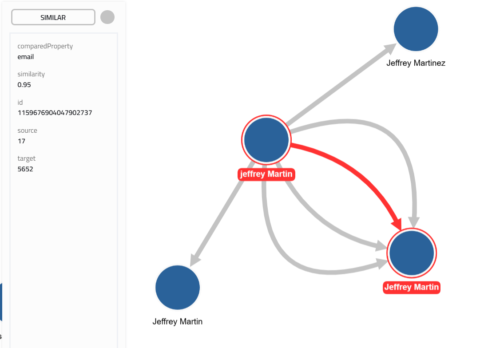
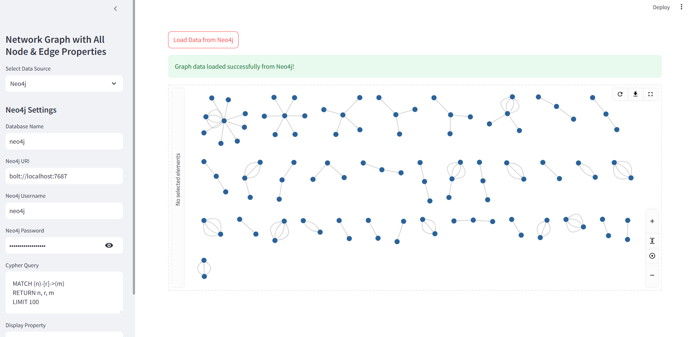

# **Entity Resolution & Network Visualization Demo**

This repository contains tools for entity resolution and graph visualization. It provides:
- A **Jupyter Notebook** (`run-ER.ipynb) for end-to-end entity resolution using **Neo4j**.
- A **Streamlit application** (`visualize_network.py`) for exploring relationships in your resolved entity data.

---

## **Table of Contents**
1. [Entity Resolution Overview](#entity-resolution-overview)  
2. [Network Visualization](#network-visualization)  
3. [Setup & Requirements](#setup--requirements)  
4. [Running the Applications](#running-the-applications)  
5. [Data Sources](#data-sources)  
6. [Customization](#customization)  
7. [License & Contribution](#license--contribution)  

---

## **Entity Resolution Overview**
The Jupyter Notebook (`entity_resolution_notebook.ipynb`) demonstrates an end-to-end entity resolution pipeline* in Neo4j

### **Pipeline Breakdown**
1. **Configuration & Setup**  
   - Imports required libraries and sets up Neo4j credentials.  
   - Configures logging and a Neo4j driver instance.

2. **Data Generation & Simulation**  
   - Generates synthetic entity data (using `Faker`) with **intentional duplicates** (e.g., name variations, typos, phone/email format changes).  
   - Inserts **controlled test clusters** to validate resolution.

3. **Data Normalization**  
   - Standardizes names, emails, addresses, and phone numbers.  
   - Updates Neo4j candidate nodes with normalized values.

4. **Similarity Calculation & Blocking**  
   - Computes **Jaro-Winkler**, **Levenshtein**, and **exact-match similarities** for key fields.  
   - Uses Neo4j **indexing & blocking** strategies to optimize comparisons.

5. **Duplicate Resolution Strategies**  
   - **Merge High Confidence**: Automatically merges highly similar nodes.  
   - **Link High Confidence**: Establishes `SAME_AS` relationships instead of merging.

6. **Master Entity Resolution**  
   - Clusters similar records and **creates master nodes** representing deduplicated entities.  
   - Assigns canonical attributes based on supporting candidate nodes.

---

## **Network Visualization**
This repository also includes a Streamlit application interactive entity relationship visualization The Graph Visualization Tool (`visualize_network.py`)  displays Neo4j & SQL-based networks dynamically in a Streamlit interface.

---

## **Setup & Requirements**

### **Pre-requisites**
Before running the applications, ensure you have:

- **Python 3.8+** installed.
- **Neo4j** (for entity resolution and visualization).
- **Jupyter Notebook** or **JupyterLab** (for the resolution pipeline).
- **Streamlit** (for graph visualization).

### **Install Python Dependencies**
Install all necessary packages with:

```bash
pip install -r requirements.yaml
```

```bash
pip conda -r requirements.yaml
```

Or install manually:

```bash
pip install streamlit neo4j faker duckdb sqlalchemy python-dotenv st-link-analysis splink
```

#### **Neo4j Database**
- Ensure **Neo4j Desktop or Neo4j Server** is running.
- Enable **APOC** and **Graph Data Science (GDS)** if using similarity calculations:
  - [APOC Installation](https://neo4j.com/docs/apoc/current/installation/)
  - [GDS Installation](https://neo4j.com/docs/graph-data-science/current/installation/)

#### **Environment Variables**
The Streamlit apps (`app.py`, `visualize_network.py`) use a **`.env` file** for Neo4j credentials:

```ini
NEO4J_URI=bolt://localhost:7687
NEO4J_USERNAME=neo4j
NEO4J_PASSWORD=neo4j12345
NEO4J_DB_NAME=neo4j
```

---

## **Running the Applications**

### **1. Entity Resolution in Jupyter Notebook**
Run the **entity resolution pipeline** inside Jupyter:

```bash
jupyter notebook
```

Open `entity_resolution_notebook.ipynb` and follow the **step-by-step entity resolution process**.

---

### **2. Network Graph Visualization**
Launch the **Streamlit-based graph visualization**:

```bash
streamlit run visualize_network.py
```

- Select **"Neo4j"** or **"Relational DB"** as the data source.
- Configure the **Cypher query** (for Neo4j) or **SQL queries** (for a relational database).
- Click **"Load Data"** to visualize the network.

---

### **3. Entity Resolution MVP (Splink)**
To run the **Splink-based entity resolution**:

```bash
streamlit run app.py
```

- Upload a **CSV file** with entity data.
- Adjust **fuzzy matching thresholds** in the sidebar.
- Click **"Run Entity Resolution"** to compute similarities.
- View **matched entity pairs** and their **match probabilities**.
- Optionally, export the results to **Neo4j**.

---

## **Data Sources**
The applications support **two types of graph data sources**:

### **1. Neo4j**
- Run queries against an **active Neo4j database**.
- Requires **Bolt connection (`bolt://...`)**.
- Uses Cypher queries to fetch **nodes and relationships**.
- Example query:
  ```cypher
  MATCH (n)-[r]->(m)
  RETURN n, r, m
  LIMIT 100
  ```

### **2. Relational Database (SQL)**
- Load graph-like data from **PostgreSQL, SQLite, MySQL, etc.**.
- Uses **SQLAlchemy** for database connections.
- Requires two tables:
  - **Nodes Table** (e.g., `nodes_view`)
  - **Relationships Table** (e.g., `relationships_view`)

#### **SQL Queries Example**
- Nodes Query:
  ```sql
  SELECT * FROM nodes_view LIMIT 100;
  ```
- Relationships Query:
  ```sql
  SELECT * FROM relationships_view LIMIT 200;
  ```

---

## **Customization**
### **1. Adjusting Similarity Matching in `app.py`**
- Modify **blocking rules** in `run_splink_linkage()`
- Adjust **Jaro-Winkler thresholds** for fuzzy name/address matching.
- Configure **probabilistic scoring** using **EM algorithm**.

### **2. Updating Graph Styling in `visualize_network.py`**
- Modify **color mapping** for node labels.
- Change **graph layouts** (e.g., `grid`, `circle`, `dagre`).
- Add **custom tooltips** for nodes/edges.

### **3. Changing Default Queries**
- Update `DEFAULT_CYPHER_QUERY`, `SQL_NODES_QUERY`, and `SQL_RELATIONSHIPS_QUERY`.

---

## **License & Contribution**
This project is licensed under the **MIT License**. See the [LICENSE](LICENSE) file for details.

**Contributions are welcome!**  
Feel free to:
- Open **issues** for bugs or feature requests.
- Submit **pull requests** with improvements.

---

## **Visualization Examples**
Below are sample screenshots from the network visualization tool:

### **Cluster View of Entities**


### **Graph View of Relationships**


---

**🚀 Ready to explore entity resolution & graph analytics? Get started today!** 🎉